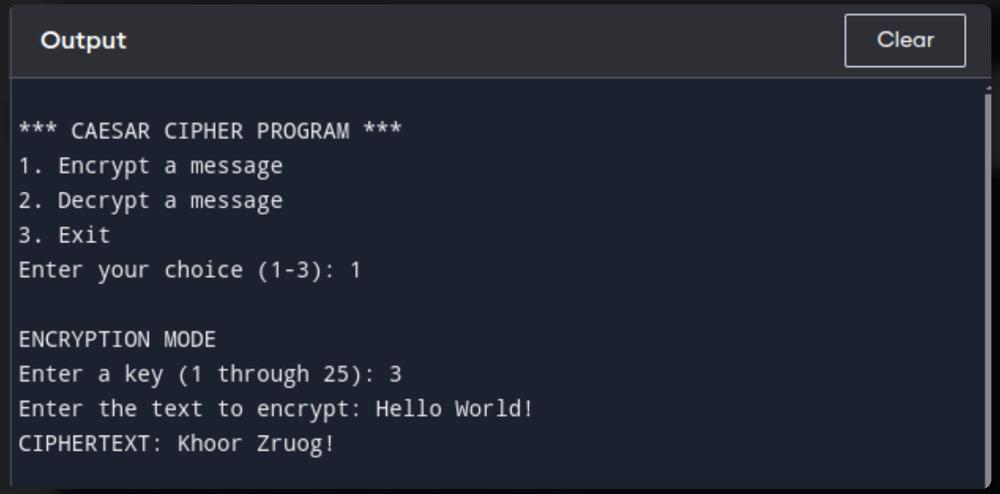
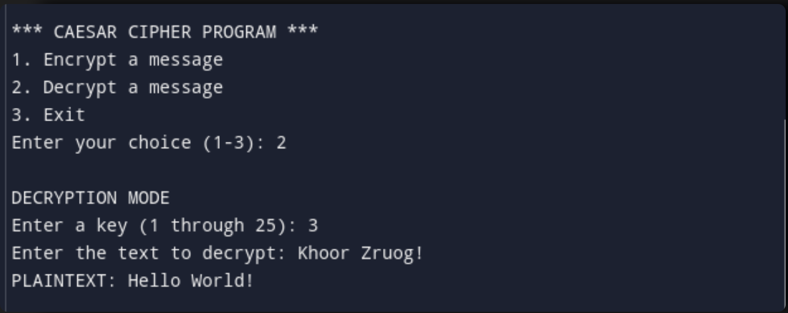
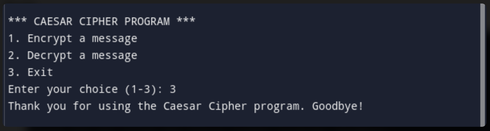

# Cryptographic Fundamentals (Caesar Cipher)
In the world of cybersecurity, encryption plays a crucial role in protecting sensitive information. One of the simplest and oldest forms of encryption is the Caesar Cipher, named after Julius Caesar, who reportedly used this method to communicate secretly with his generals, the Caesar Cipher provides an excellent starting point for understanding basic cryptographic concepts.

In this tutorial, we will walk through how to implement a Caesar Cipher in Python, allowing you to both encrypt and decrypt messages.

## Content
- 

## What is the Caesar Cipher?
The **Caesar Cipher** is a substitution cipher which works by shifting each letter of a message (plaintext) by a fixed number of positions in the alphabet. This fixed number is known as the **"key"** or **"shift"**.

Here's how it works:

1. Choose a key (let's say 3).
2. For each letter in your message:
   - Shift it forward in the alphabet by the number of positions specified by the key.
   - If you reach the end of the alphabet, wrap around to the beginning.
3. Non-alphabetic characters (spaces, punctuation) remain unchanged.

For example, with a shift of 3:
- 'A' becomes 'D'
- 'B' becomes 'E'
- 'Y' becomes 'B' (wrapping around)
- 'Z' becomes 'C' (wrapping around)
  
So, the message **"HELLO WORLD"** with a shift of 3 would become **"KHOOR ZRUOG"**.
- During encryption, each letter in the message is shifted forward in the alphabet by the key value.
- During decryption, each letter in the encrypted message is shifted backward in the alphabet by the key value.
- The shift wraps around the alphabet, meaning if we go past Z, we loop back to A.

## Implementation of Caesar Cipher
Let's dive into the Python code that implements this algorithm. We'll explain each part in detail so that you understand not only how the code works, but also why it works.

<pre><code>import string
def encrypt_decrypt(text, mode, key):
    letters = string.ascii_lowercase
    num_letters = len(letters)
    result = ''

    key = key % num_letters
    if mode == 'd':
        key = -key

    for char in text:
        if char.isalpha():
            if char.isupper():
                start = ord('A')
            else:
                start = ord('a')

            new_position = (ord(char) - start + key) % 26
            result += chr(start + new_position)
        else:
            result += char

    return result
</code></pre>

- We import the <code>string</code> module to help us handle the alphabet. We'll use it to get both the lowercase and uppercase letters easily.
- The <code>encrypt_decrypt</code> function takes care of both encryption and decryption based on the mode selected by the user.
- <code>text</code> is a parameter that represents the message to be encrypted or decrypted.
- <code>mode</code> is a parameter that specifies whether we are encrypting (**'e'**) or decrypting (**'d'**).
- <code>key</code> is a parameter that represents the number of positions by which to shift each letter in the text.
- <code>letters = string.ascii_lowercase</code> stores all lowercase letters in the alphabet, which we can use to calculate shifts.
- The modulo operator <code>% 26</code> ensures that when the new position exceeds 25 (the index for 'Z'), it wraps around to 0 (the index for 'A').
- If the mode is **'d'** (decryption), we make the key negative (<code>key = -key</code>), so that letters are shifted in the opposite direction.
- If the character is a letter, we calculate its position in the alphabet using <code>ord(char)</code> (which gives us the Unicode value of the character).
- Depending on whether it's an uppercase or lowercase letter, we find the new position after applying the shift and convert it back to a character using <code>chr()</code>.
- If the character is not a letter (e.g., spaces or punctuation), we leave it unchanged and add it to the result.

## Getting a Valid Key

<pre><code>def get_valid_key():
    while True:
        try:
            key = int(input('Enter a key (1 through 25): '))
            if 1 <= key <= 25:
                return key
            else:
                print("Key must be between 1 and 25. Please try again.")
        except ValueError:
            print("Invalid input. Please enter a number between 1 and 25.")
</code></pre>

The <code>get_valid_key()</code> function ensures that the user inputs a valid key between 1 and 25. If the input is invalid (either not a number or outside the acceptable range), the program will prompt the user to try again. This function prevents errors due to incorrect user input.

## Main Function

<pre><code>def main():
    while True:
        print("\n*** CAESAR CIPHER PROGRAM ***")
        print("1. Encrypt a message")
        print("2. Decrypt a message")
        print("3. Exit")

        choice = input("Enter your choice (1-3): ")

        if choice == '1':
            print("\nENCRYPTION MODE")
            key = get_valid_key()
            text = input('Enter the text to encrypt: ')
            ciphertext = encrypt_decrypt(text, 'e', key)
            print(f'CIPHERTEXT: {ciphertext}')

        elif choice == '2':
            print("\nDECRYPTION MODE")
            key = get_valid_key()
            text = input('Enter the text to decrypt: ')
            plaintext = encrypt_decrypt(text, 'd', key)
            print(f'PLAINTEXT: {plaintext}')

        elif choice == '3':
            print("Thank you for using the Caesar Cipher program. Goodbye!")
            break

        else:
            print("Invalid choice. Please enter 1, 2, or 3.")

if __name__ == "__main__":
    main()
</code></pre>

The program presents a simple menu where the user can choose to encrypt a message, decrypt a message, or exit the program.

- When a user chooses option 1, the user enters a text and a shift key, the program calls <code>encrypt_decrypt()</code> with mode <code>e</code> for encryption and displays the encrypted message.
- When a user chooses option 2, the user inputs the encrypted text and the key used for encryption, the program calls <code>encrypt_decrypt()</code> with mode <code>d</code> for decryption and displays the original message.
- When a user chooses option 3, the program terminates.

## Program in Action
### Encryption

### Decryption

### Exit

## Conclusion
While the Caesar Cipher is an excellent learning tool, it's crucial to understand some of its limitations:
- With only 25 possible shifts, it's vulnerable to brute-force attacks.
- In longer messages, letter frequencies can be analyzed to break the cipher.

In this tutorial, we’ve implemented a Caesar Cipher in Python that allows users to both encrypt and decrypt messages.

Happy coding, and stay secure!
